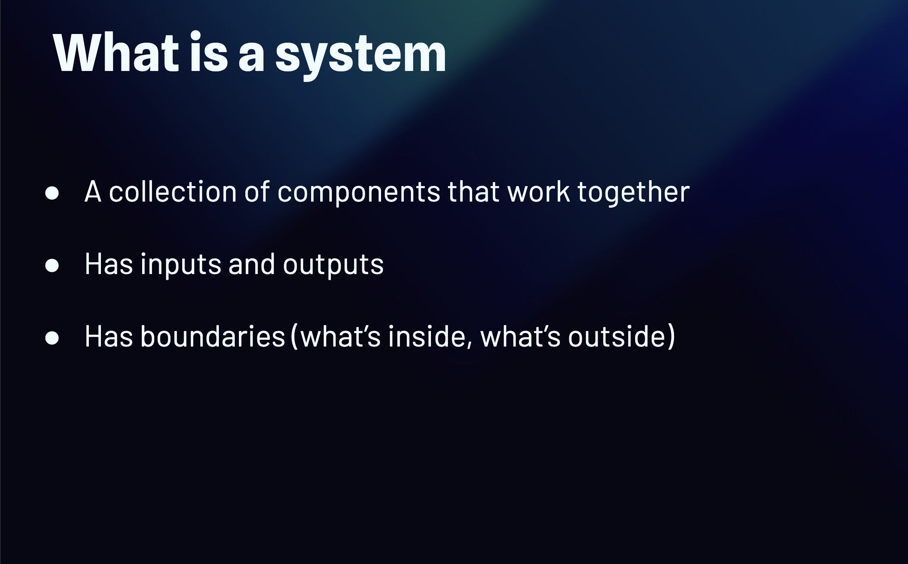

# Everything Is a System

Before getting into backend architecture, we first need to understand what a **system** is.

A system is a collection of components that work together to achieve a goal.

For example, a backend system can contain:

* API servers
* Databases
* Caches
* Queues
* Workers

Each component has a responsibility, but they work together as one system.

## What Is a System?

A system has three basic characteristics:

### 1. Components

A system is made of different components that work together.

```text
API → Database
 │
 └──→ Cache
```

### 2. Inputs and Outputs

A system receives **inputs**, processes them, and produces **outputs**.

```text
Input → System → Output
```

For example:

```text
HTTP Request → Backend → HTTP Response
```

### 3. Boundaries

A system has a **boundary** that defines what is inside and what is outside.

```text
        System
┌─────────────────────┐
│ API → Database      │
│  │                  │
│  └──→ Cache         │
└─────────────────────┘
   ↑               ↑
 Client       External Service
```

The API, database, and cache are inside the system, while the client and external services are outside.

### Why Does This Matter?

When designing a backend system, we need to understand:

* What are the components?
* How do they communicate?
* What are the inputs and outputs?
* What is inside the system?
* What is outside the system?

This simple way of thinking helps us understand more complex architectures later.


