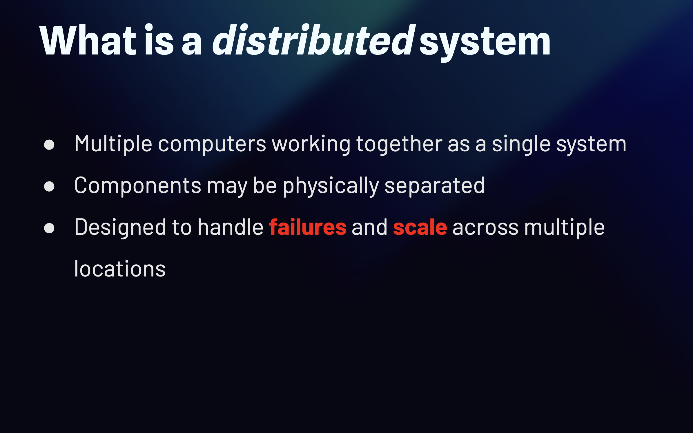

# What Is a Distributed System?

A **distributed system** is a collection of multiple computers that work together as a single system.

Instead of running everything on one machine, the workload is distributed across multiple machines.

```text
        ┌───────────┐
        │  Client   │
        └─────┬─────┘
              │
       ┌──────▼──────┐
       │ Load Balancer│
       └──────┬──────┘
          ┌───┴───┐
          ▼       ▼
      ┌──────┐ ┌──────┐
      │Server│ │Server│
      │  1   │ │  2   │
      └──────┘ └──────┘
```

The different machines may be **physically separated** and communicate over a network.

A distributed system is usually designed to:

* **Scale** by adding more machines
* **Handle failures** when a machine or service goes down
* **Distribute workloads** across multiple machines
* **Operate across different locations** or data centers

The key idea is simple:

> **Multiple machines work together to behave like one system.**

However, distributing a system also introduces new problems. Machines can fail independently, networks can become unavailable, messages can be delayed or lost, and keeping data consistent becomes more difficult.

Understanding these problems is one of the foundations of **distributed system design**.


