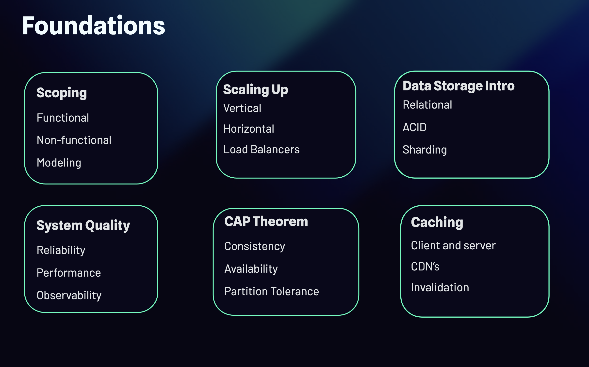

# Introduction

This repository documents the core principles and architectural decisions behind modern backend system design. Rather than focusing on memorizing specific architectures or technology stacks, the goal is to understand the reasoning and trade offs that lead to building scalable, reliable, and maintainable systems.

We begin with **system scoping**, one of the most critical and often overlooked steps in system design. Before choosing technologies or drawing architecture diagrams, it is essential to clearly define the problem, understand the requirements, identify constraints, and determine what success looks like. A well defined scope is the foundation of every successful system.

From there, we explore the characteristics of **high quality systems**, including reliability, availability, performance, maintainability, and resilience. Understanding these quality attributes helps guide architectural decisions and ensures systems can meet both business and technical expectations.

Next, we cover **scalability** and the different ways a system can grow. Whether scaling users, requests, data volume, or throughput, each approach introduces unique challenges and design considerations. We discuss common scaling strategies and when to apply them.

Since every architectural decision involves compromises, we also examine the **CAP Theorem** and the importance of understanding distributed system trade offs. Designing distributed systems is less about finding perfect solutions and more about making informed decisions based on the system's priorities.

Data is at the heart of every backend application, so we introduce the fundamentals of **data storage**, including how different database models influence architecture, consistency, and performance. This topic serves as the foundation for many of the design patterns explored throughout the documentation.

Finally, we discuss **caching**, one of the most effective techniques for improving performance and reducing system load. We explore where caching fits into a backend architecture, the different caching strategies available, and the trade offs involved in keeping cached data consistent and up to date.

By the end of this documentation, you will have a solid understanding of the fundamental concepts, design principles, and architectural patterns required to build robust, scalable backend systems.

